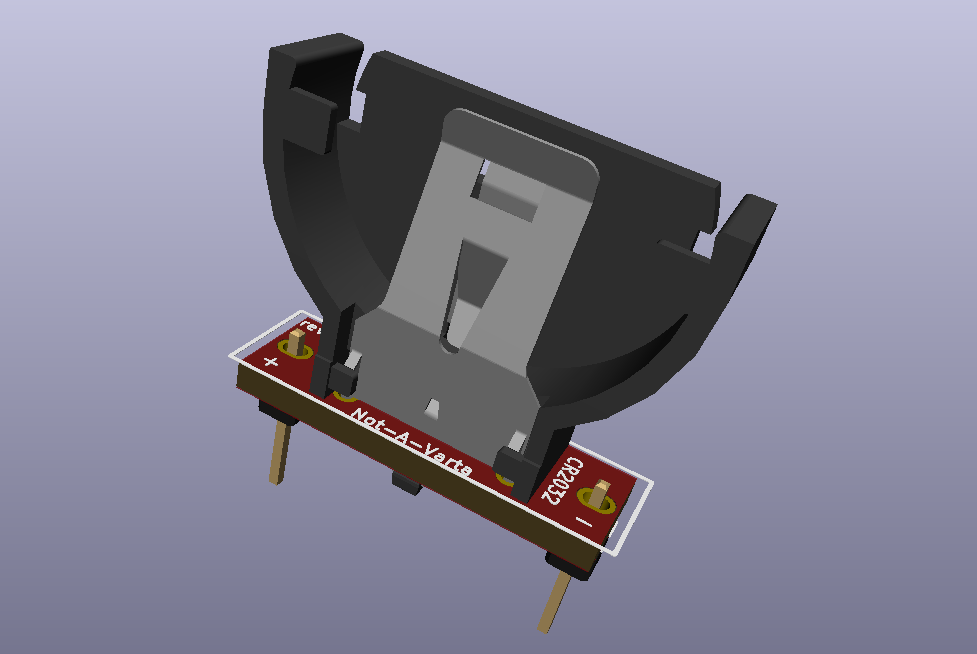

# Not-A-Varta CR2032
Similar to the "Not-A-Varta", but with a vertical CR2032 holder, and elongated mounting holes.

## Info
Same concept as the Not-A-Varta, except with a vertical CR2032 holder and elongated mounting holes for better fit across various motherboards which can have anywhere from 18-20mm pin spacing.
\
\
Open hardware design. Feel free to do what you want with it.
